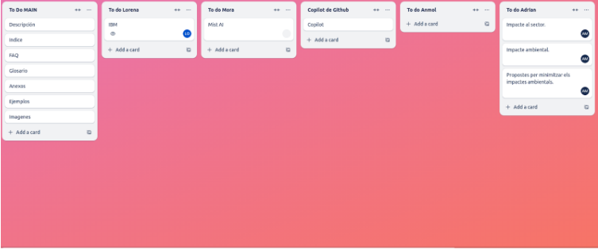
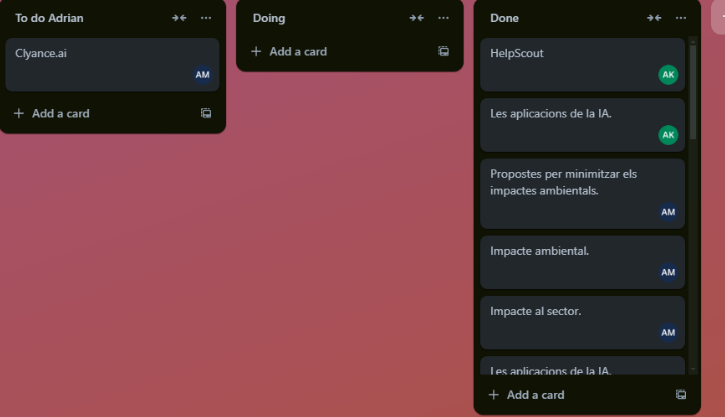

# Introducción

>📃Explica el proceso seguido para publicar en GitHub Pages en un apartado del manual.📃
>

## Proceso

### Dia 1
En el primer dia asignamos las tareas que debia hacer cada mienmbro del equipo e hicimos el primer pull request. También creamos las brunches donde iba a trabajar cada uno.

### Dia 2
El segundo dia adelantamos informacion

### Dia 3
Este dia añadimos las tareas para la pagina principal e hicimos 3 pull request

### Dia 4
El segundo dia adelantamos informacion

### Dia 5
El quinto dia adelantamos informacion y como las pull request no daban error tuvimos que copiar y pegar toda la información en fillers creadas directamente en main

### Final 
El ultimo dia dimos los ultimos retoques y publicamos el sitio web.

### Publicación
Para publicar la página web nos drigimos al setting del repositorio al apartado pages y damos a la opcion de craer un apagina web desde la branche main que contenga el repositorio. Un vez publicada la pagina ya tenemos nuestro manual.

